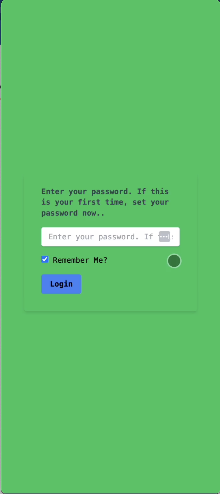
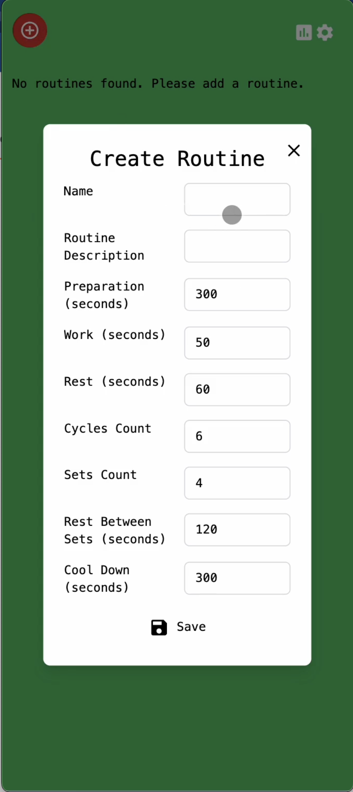
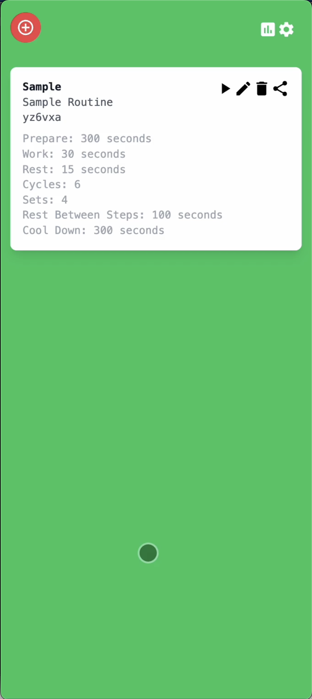
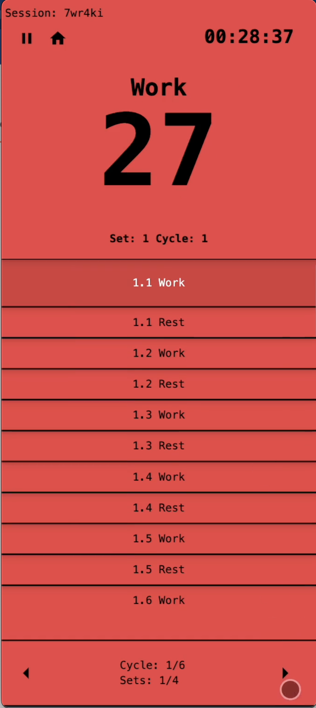
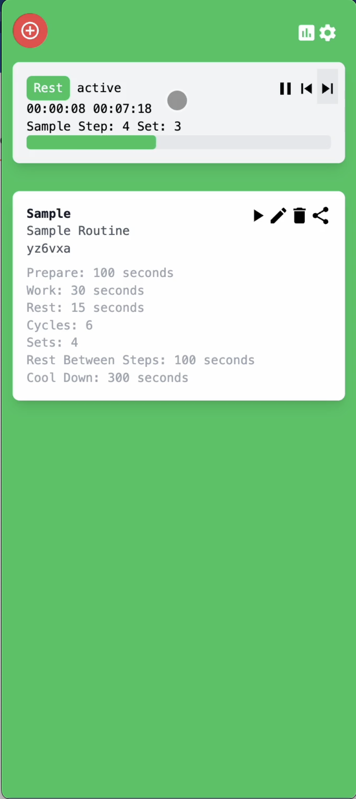
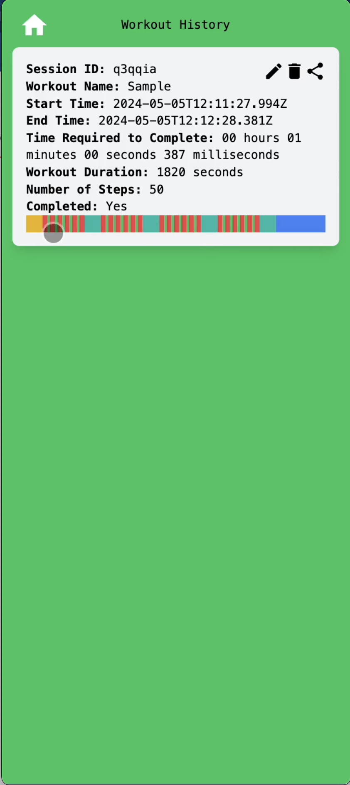

## Web5 Tabata Timer

No ads. Open source. Personal use. No tracking. Free. No paywall. Own and share your workout data with a web5 based tabata timer.

Tabata timers are used for HIT excrcises. They give you short increments of
exercies and rest. I use it quite a bit, but the one I use has a paywall after 2
routines and has a ton of ads. I don't want any of that. 

This is a web5 based tabata timer.

What does web5 mean? Well, you'll own your data. Entirely. This means that you
don't need to worry about us looking at it ever. This was mostly a fun project
for myself, but I'll try to release it out the play store in the near future.

## Status

**In Progress. Early Version Works**

## Getting Started

First, run the development server:

```bash
npm run dev
# or
yarn dev
# or
pnpm dev
# or
bun dev
```

## Screenshots
<table>
<tr>
  <td valign="top">
    <p><strong>Encrypt your data with your own DWN</strong></p>
    
  </td>
  <td valign="top">
    <p><strong>Create a Routine</strong></p>
    
  </td>
  <td valign="top">
    <p><strong>Choose your routine</strong></p>
    
  </td>
  <td valign="top">
    <p><strong>Play Screen. See your cycles.</strong></p>
    
  </td>
</tr>
<tr>
  <td valign="top">
    <p><strong>Toolbar to see your workout on the home page</strong></p>
    
  </td>
  <td valign="top">
    <p><strong>See your work history</strong></p>
    
  </td>
</tr>
</table>

## Demo

See demo in [./docs/Web5 Tabata Timer Demo v0.0.2.mp4](./docs/Web5 Tabata Timer Demo v0.0.2.mp4)

## Work in Progress

* Features

- [x] Play View
- [x] Workout Selection View
- [x] Configure Routine View
- [x] Sound
- [x] PWA
- [x] Run in background 
- [x] Header for current workout
- [x] Edit Routines
- [x] Delete Routines
- [x] Settings
- [x] Save Sessions
- [x] Done Screen
- [x] Vibrate on 3 seconds
- [x] Activity Screen
  - [x] Delete Session
  - [ ] Edit Session
  - [ ] Search
  - [ ] Overview / Heatmap
- [ ] Launch on Google Play store <- Internal Testing
- [ ] Service Workers
  - [x] Wake Lock
  - [ ] Background Workout
  - [ ] Notifications
- [ ] Lock Screen Preview
- [ ] Sync 
- [ ] Share sessions
 - [ ] Add friends
- [ ] Better password management

* Bug Fixes

- [x] Fix Build 
- [x] Fix Pause/Play
- [x] Fix Inputs For Form
- [x] Fix component size for steps on Play View
- [x] Maskable Logo
- [x] Multiple sessions for a single workout
- [ ] Timer stops on sleep 
  
* Code

- [x] Change state mangaement to redux
- [x] First Major Refactor.
- [ ] Too many ts-ignores. Cleanup
- [ ] Remove old files
- [ ] Second Major Refactor

* Integrations

- [ ] Google Fit
- [ ] Strava

## Disclosures

This was also a project for me to get to learn more about how front end works. The way react manages state, redux, etc, required me to come up the learning curve. 

I'm sure that those more comfortable with front end might gouge out their eyes at some of the patterns. I will try to fix them.

## Limitations 

If you check out existing solutions, some of them have some toolbar that sits on the lockscreen. Unfortunately, due to the limits of a pwa, that's not possible for this app. We might be using the MediaSession API or I can toss notifications/push events, but that's where it falls short. I could make this react-native, but maybe another time.

## Alternatives

- [Tabata Timer: Interval Timer ](https://play.google.com/store/apps/details?id=com.evgeniysharafan.tabatatimer&hl=en&gl=US&google_abuse=GOOGLE_ABUSE_EXEMPTION%3DID%3Db350816d64fae8f3:TM%3D1714433385:C%3D%3E:IP%3D49.37.163.25-:S%3DnDI4qYnhbHEdeM3q0kSbaw%3B+path%3D/%3B+domain%3Dgoogle.com%3B+expires%3DTue,+30-Apr-2024+02:29:45+GMT) -- The main app on the app store. 5M+ downloads. This is hidden behind a paywall, has ads, is not open source. We can do better. It's farther along, and has been worked on longer, but I hope that in time this app is going to clearly be better than that app. 
