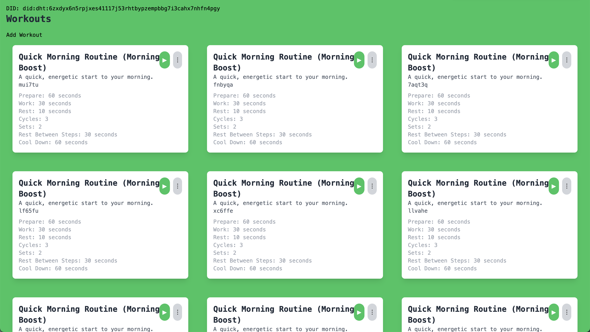
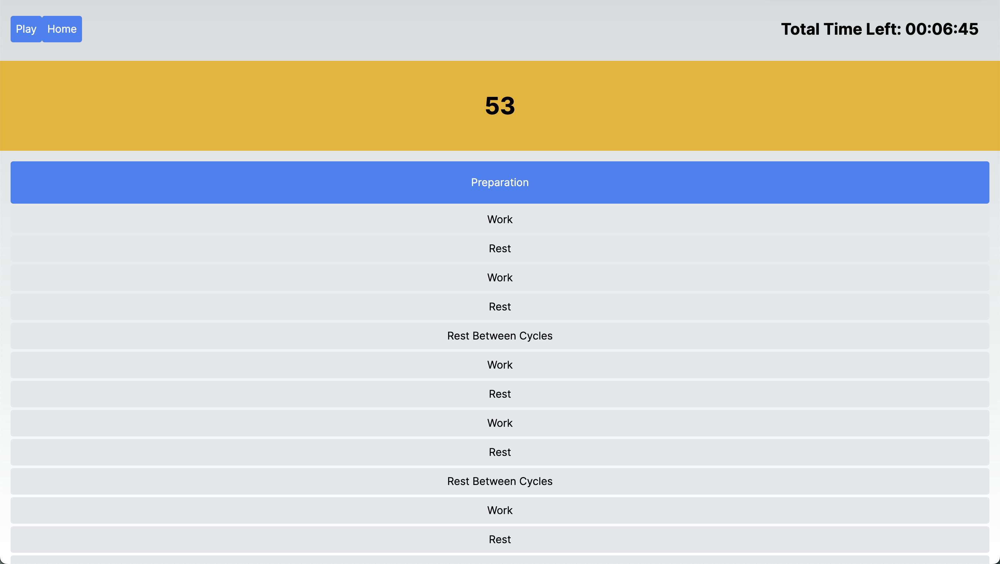
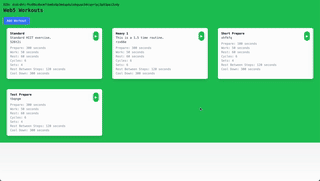

## Web5 Tabata Timer

No ads. Open source. Personal use. No tracking. Free. No paywall. Own and share your workout data with a web5 based tabata timer.

Tabata timers are used for HIT excrcises. They give you short increments of
exercies and rest. I use it quite a bit, but the one I use has a paywall after 2
routines and has a ton of ads. I don't want any of that. 

This is a web5 based tabata timer.

What does web5 mean? Well, you'll own your data. Entirely. This means that you
don't need to worry about us looking at it ever. This was mostly a fun project
for myself, but I'll try to release it out the play store in the near future.

## Status

**In Progress. Early Version Works**

## Getting Started

First, run the development server:

```bash
npm run dev
# or
yarn dev
# or
pnpm dev
# or
bun dev
```

## Screenshots

* Choose your routine


* Play through the routine


## Demo

<div class="align-center">
 
</div>

## Work in Progress

* Features

- [x] Play View
- [x] Workout Selection View
- [x] Configure Routine View
- [x] Sound
- [x] PWA
- [x] Run in background 
- [ ] Launch on Google Play store <- IN PROGRESS
- [ ] Header for current workout
- [ ] Notifications
- [ ] Edit Routines
- [ ] Delete Routines
- [ ] Save Sessions
- [ ] Sync 
- [ ] Share sessions
- [ ] Settings
- [ ] Better password management
- [ ] Vibrate on 3 seconds
- [ ] Done Screen

* Bug Fixes

- [x] Fix Build 
- [x] Fix Pause/Play
- [x] Fix Inputs For Form
- [ ] Fix component size for steps on Play View
- [ ] Show running workout on top of home and allow you to re-enter it. 
- [ ] Backup/Sync

* Code

- [ ] Too many ts-ignores. Cleanup
- [ ] Remove old files

* Other

- [x] Major Refactor. Consider not using Next JS. No reason to use it.
- [x] Change state mangaement to redux

## Disclosures

This was also a project for me to get to learn more about how front end works. The way react manages state, redux, etc, required me to come up the learning curve. 

I'm sure that those more comfortable with front end might gouge out their eyes at some of the patterns. I will try to fix them.

## Alternatives

- [Tabata Timer: Interval Timer ](https://play.google.com/store/apps/details?id=com.evgeniysharafan.tabatatimer&hl=en&gl=US&google_abuse=GOOGLE_ABUSE_EXEMPTION%3DID%3Db350816d64fae8f3:TM%3D1714433385:C%3D%3E:IP%3D49.37.163.25-:S%3DnDI4qYnhbHEdeM3q0kSbaw%3B+path%3D/%3B+domain%3Dgoogle.com%3B+expires%3DTue,+30-Apr-2024+02:29:45+GMT) -- The main app on the app store. 5M+ downloads. This is hidden behind a paywall, has ads, is not open source. We can do better. It's farther along, and has been worked on longer, but I hope that in time this app is going to clearly be better than that app. 
